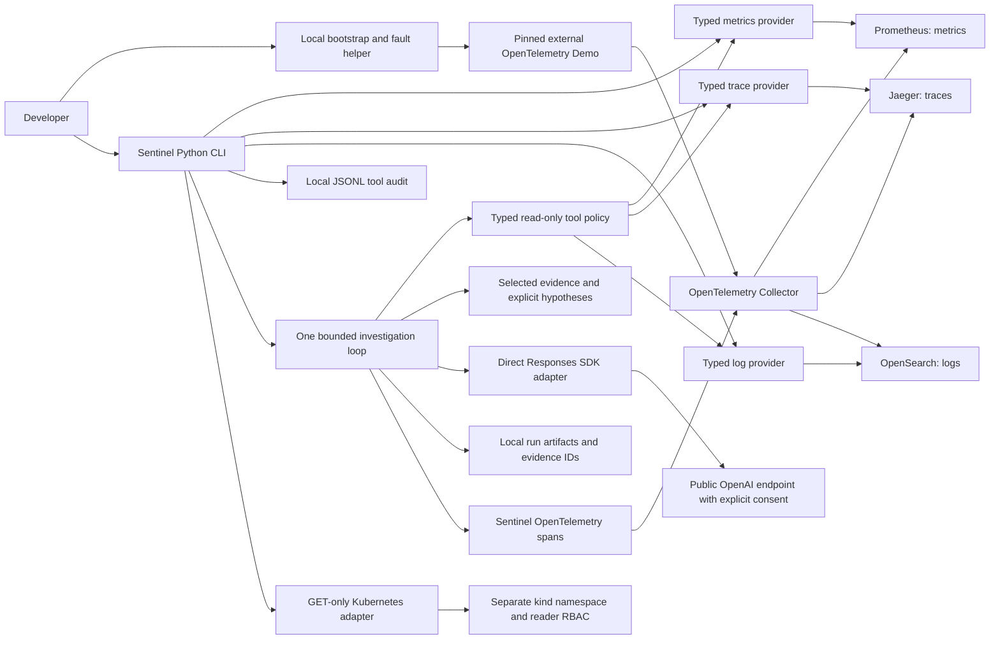

# Architecture: read-only investigation stage

Sentinel's product goal is evidence-driven incident investigation. The current
implementation includes a reproducible target, native telemetry/Kubernetes reads,
and one bounded investigation loop. Live AI diagnosis awaits ChatGPT sign-in.

The diagram summarizes the telemetry flow; each backend's precise receiver and
exporter wiring comes from the pinned upstream configuration. The bootstrap
smoke-checks backend availability. Each provider validates its inputs and response
shape, reduces data to typed results, and exposes a bounded diagnostic read. Live
compatibility was verified on 2026-10-04, including a payment fault and recovery.

## Components and data flow

`scripts/demo.py` downloads the commit archive into an ignored cache and renders
the official core, full, observability, and extras Compose layers. It adjusts
project/container/network/volume names and published ports for an isolated local
lab. It rejects untagged and `latest` images and starts only prebuilt images.
The local download hash is provenance, not an independent upstream checksum.
Upstream image tags are release-pinned but not digest-locked yet.

The external demo is a web store with synthetic traffic, backend services, and
dependencies. Its telemetry feeds Prometheus, Jaeger, and OpenSearch. Grafana
provides human inspection. None of these external components is Sentinel's own
application logic. Inspect the exact service inventory with `make demo-status`;
the source of truth is the pinned Compose configuration, not a hypothetical PRD
incident story. The validated runtime has 28 Compose services and 19 traced
service identities. The browser SDK contributes `frontend-web` without a separate
container; databases, storage, and observability containers do not each have an
application trace identity. See the inventory in
[checkpoint 1](checkpoints/01-architecture.md).

The Collector exports metrics with OTLP/HTTP to Prometheus's `/api/v1/otlp`,
traces with OTLP/gRPC to Jaeger, and logs to date-suffixed `otel-logs` indices in
OpenSearch. Its span-metrics connector derives call counters and duration
histograms from traces. In this full deployment, the merged metrics receiver
array replaces the core array and drops `prometheus/ad`; the Prometheus `up`
series is absent. Readiness therefore checks active series, while incident
diagnosis uses operation status, correlated traces, and logs.

`sentinel/tools/metrics/` implements the `MetricsProvider` protocol with a
Prometheus HTTP adapter. A developer submits PromQL and optionally a bounded time
window. The adapter validates the request, obtains bounded JSON, and translates
float samples into dataclasses. Invalid backend responses become explicit tool
failures. Non-finite values remain missing. Generic PromQL is a developer
diagnostic surface. Model-facing semantic tools construct their own fixed
service/window queries and reductions before evidence enters model context.

`sentinel/tools/traces/` implements the `TraceProvider` protocol with an isolated
Jaeger UI compatibility adapter. It discovers services, queries bounded traces,
and reads aggregated service dependencies. It preserves correlation and parent
IDs, summarizes all spans, and selects error spans before the longest remaining
spans. Omission counts and backend warnings remain explicit. The trace envelope
is measured from the first observed start to the last observed end, avoiding
double-counted parallel spans. It is not a critical-path calculation.

`sentinel/tools/logs/` implements the `LogProvider` protocol with an OpenSearch
adapter. The developer configures explicit field paths and timestamp encoding.
The adapter checks field capabilities, then searches by exact service and time
with a result limit. It rejects partial searches and groups identical messages
and severity within the returned sample. Document IDs include their index, and
trace IDs are preserved when present. The schema is not inferred from PRD examples.
See [ADR 006](decisions/006-telemetry-compatibility.md) for compatibility boundaries.

`sentinel/tools/audit.py` records a started event before the CLI invokes a tool,
then a completion event with the same ID, outcome, latency, and summary. Records
live in an ignored local JSONL file. Agent runs add evidence IDs, full payloads,
contexts, decisions, hypotheses, usage, outcomes, and OTel spans in a separate run
directory. Database-backed transactional persistence comes later.
The current audit helper is for a single local CLI process, not a distributed
job coordinator or durable transactional event store.

`scripts/capture.py` is a developer lab utility that reads all three localhost
backends for a bounded payment window. It preserves independent results if one
signal fails, marks the capture incomplete, and refuses existing output paths.
It records query expressions, field schema, time windows, source pin, sample
limits, and the on-disk flag value. These are manual diagnostic artifacts,
not agent runs or benchmark scores.

`sentinel/agent/` separates closed contracts, semantic tools, context selection,
model transport, local wiring, and the explicit loop. A model selects one
`investigation_step`; application policy permits one bounded read or validates a
terminal result. Evidence citations must refer to successful reads and include
multiple evidence kinds. These checks cannot establish causal correctness.
Models cannot select arbitrary queries/paths/endpoints or execute remediation.
Source/configuration are explicit pinned/current snapshots with coverage limits.
See [the investigation guide](investigation.md) and [ADR 007](decisions/007-bounded-investigation.md).

`sentinel/auth.py` implements the developer-selected public ChatGPT sign-in flow.
It validates browser callback/identity/grant, protects local credentials, rotates
refresh tokens, and uses the account model catalog. It never reads Codex tokens.
The SDK consumes a completed stream and records measured usage. Subscription
preview limitations prevent an exact client-side credit cap; explicit API mode
has known-price reservations. See [ADR 008](decisions/008-chatgpt-authentication.md).

`sentinel/tools/kubernetes.py` uses only a namespaced reader token over verified
TLS and GET-only resource paths. `scripts/kind_lab.py` is the separate developer
admin bootstrap. The small fixture is not the Compose application's pod state.
Role checks and actual adapter reads passed against kind; see
[Kubernetes scope](kubernetes.md).

`scripts/validate_scenarios.py` captures three reversible real faults without
model calls. `evals/scenarios.json` contains ground truth/setup/cleanup outside
model context. Structural grading signals require manual causal review and do
not produce an accuracy score. The first live exercise stops after one model run
and cleanup; [checkpoint 2](checkpoints/02-first-investigation.md) remains pending.

## Five decisions

1. [Use a pinned external reference application](decisions/001-reference-environment.md).
2. [Bootstrap locally with Compose, then add kind](decisions/002-local-first.md).
3. [Keep native typed diagnostics explicit and independent of providers](decisions/003-tool-contracts.md).
4. [Separate read-only diagnostics from developer fault injection](decisions/004-safety-boundaries.md).
5. [Separate deterministic tests, live integration, and later AI evaluation](decisions/005-validation.md).

## Planned product architecture

The first explicit agent and typed hypotheses/evidence are implemented. After
checkpoint 2 and review of a correct live investigation,
FastAPI, PostgreSQL/SQLAlchemy/Alembic, and justified Redis usage provide product
APIs and persistence. Next.js/React/TypeScript provides the incident dashboard
and chat. Model and telemetry providers remain replaceable through adapters.
MCP transports follow stable native contracts. Kubernetes target migration,
GitHub context, controlled remediation, and ephemeral Terraform/EKS deployment
follow the PRD phases and permission checkpoints.

The project has no agent write permissions or cloud deployment at this stage.
Infrastructure remediation will require application-enforced policy, human
approval, audit records, and post-action recovery verification.

## Failure modes and development

Bootstrap needs network access, sufficient Docker resources, available host
ports, and matching release images for the machine's architecture. Failed
downloads leave no installed source directory; mismatching caches are not
overwritten. Compose startup has a 180-second wait limit and preserves failed
containers for inspection. Telemetry can require additional warmup after
container startup. Query transport has a timeout and response-size limit with no
automatic retries. Unsupported sample formats fail instead of inventing data.
Field mappings can drift across indices, log bodies can use unsupported structured
formats, and Jaeger's internal UI API can change. These become explicit adapter
failures. Empty dependency results do not establish an empty service topology.

Use `make check` for deterministic validation and opt-in live tests after
`make demo-up`. Review the relevant ADR, upstream service configuration, and
test boundary before changing provider or bootstrap behavior. See the
[learning guide](learning/bootstrap.md) for checkpoint questions.
