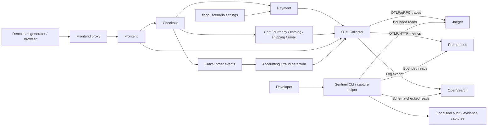

# Checkpoint 1: local architecture and diagnostic evidence

**Status: acknowledged on 2026-10-04.** The developer instructed continued work
following the guide toward a defensible resume project. Later learning,
write-permission, and AWS checkpoints remain in effect.

On 2026-10-04, the pinned OpenTelemetry Demo started locally, the metrics,
trace, and log adapters passed live checks, and the developer payment-failure
scenario produced correlated evidence followed by successful transactions after
reset. This document records the bootstrap as reviewed on that date. At that
point Kubernetes state reads, semantic tools, the investigation agent, product
API, database, web UI, and cloud deployment were still absent. Read
[current progress](../progress.md) for later implementation and validation.

## Architecture and data flow

The application portion shows the relevant checkout path, not every application
edge. Upstream instrumentation emits signals to the Collector; its span-metrics
connector also derives counters and duration histograms from traces. The
Collector exports to separate query backends. Sentinel reads those backends,
validates response contracts, and reduces traces and repeated logs into typed
results. The CLI records tool arguments, outcomes, timing, and summaries.
The developer helper writes one allowlisted fault flag; it is outside the
diagnostic tool surface.

## Actual service inventory

The rendered full runtime contains **28 Compose services**:

| Services | Purpose |
| --- | --- |
| `frontend-proxy`, `frontend`, `image-provider` | Web entry point, storefront/API, product images |
| `checkout` | Coordinates an order and calls dependent services |
| `payment` | Simulated card validation/charge path; hosts the first fault |
| `cart`, `product-catalog`, `currency` | Cart operations, catalog queries, currency conversion |
| `shipping`, `quote`, `email` | Shipping operations/quotes and order confirmation |
| `recommendation`, `ad` | Product recommendations and advertising |
| `kafka`, `accounting`, `fraud-detection` | Order-event broker and asynchronous consumers |
| `astronomy-db`, `valkey-cart` | PostgreSQL application state and Valkey cart storage |
| `flagd`, `flagd-ui`, `load-generator` | Fault controls, flag editor, synthetic customer traffic |
| `otel-collector` | Receives/processes/exports telemetry and derives span metrics |
| `prometheus`, `jaeger`, `opensearch` | Queryable metrics, traces, and logs |
| `grafana`, `opamp-server`, `telemetry-docs` | Human dashboards, Collector status reporting, telemetry documentation |

Jaeger discovered **19 traced service identities**: accounting, ad, cart,
checkout, currency, email, flagd, fraud-detection, frontend, frontend-proxy,
frontend-web, image-provider, load-generator, payment, product-catalog, quote,
recommendation, shipping, and telemetry-docs. `frontend-web` is browser
instrumentation, not another container. Container count and trace-service count
measure different things.

The external demo is upstream work. Sentinel's original code is the bootstrap,
adapter contracts/validation/reduction, audited CLI, capture utility, tests, and
documentation. The eventual investigation loop and product are still to be built.

## Local setup and verified technology

Run `make doctor`, `make demo-up`, `make demo-status`, and `make demo-verify`.
Docker Desktop needs to be running, and the executing shell needs access to its
socket, GitHub's source archive endpoint, and container registries. No repository
link or GitHub account is required to download the public demo. The local session
required approved shell access beyond its default sandbox.

The tested host used Python 3.14.7, Docker 28.5.1, Compose 2.40.3, and ARM Linux
containers, with about 8 GB and 11 CPUs available to Docker. The source is
Demo **3.1.0**, commit `dedc0178918e260823323b8d95005a8cb924b007`.
Observed component versions were Jaeger 2.19.0, Collector Contrib 0.159.0,
Prometheus 3.13.1, OpenSearch 3.7.0, Grafana 13.1.0, PostgreSQL 18.4, Valkey
9.0.4, and flagd 0.16.0. Release tags are pinned; image digests are not locked.

The store is at <http://127.0.0.1:8080>, flags at
<http://127.0.0.1:8080/feature>, Grafana at
<http://127.0.0.1:8080/grafana/>, Prometheus at <http://127.0.0.1:9090>,
Jaeger at <http://127.0.0.1:8080/jaeger/ui/>, and OpenSearch at
<http://127.0.0.1:9200>. Four ports are published on loopback, including Jaeger's
direct port 16686. `make demo-down` stops the isolated `sentinel-demo` project
and retains source and volumes. Reset any tracked fault before stopping it.

Compose gives us a repeatable local target without cloud cost or cluster
prerequisites. The stdlib Python adapters keep the initial diagnostic surface
small and testable without LLM keys. Prometheus, Jaeger, and OpenSearch already
provide the signal storage/query capabilities; Sentinel adds investigation logic
later. The planned stack remains FastAPI/Pydantic, PostgreSQL with
SQLAlchemy/Alembic, and Next.js/React/TypeScript. Redis needs a concrete use case.

## Top five decisions

| Decision | Reason and tradeoff |
| --- | --- |
| [Pinned external target](../decisions/001-reference-environment.md) | Real distributed telemetry and reproducible faults; upstream ownership and mutable image tags remain explicit |
| [Compose first, kind next](../decisions/002-local-first.md) | Establish local telemetry before cluster complexity; Kubernetes evidence is still missing |
| [Explicit native typed contracts](../decisions/003-tool-contracts.md) | Provider-independent results with visible units/failures/limits; semantic model tools and async transport come later |
| [Read-only diagnostics, separate lab writes](../decisions/004-safety-boundaries.md) | Reproduce faults without granting a future agent shell access; write policy and RBAC need checkpoint 3 |
| [Separate validation layers](../decisions/005-validation.md) | Offline tests establish code behavior, live tests establish interoperability, later AI evaluations measure reasoning |

[ADR 006](../decisions/006-telemetry-compatibility.md) records the temporary,
version-sensitive Jaeger UI API and explicit OpenSearch schema. Moving to a
stable Jaeger read API is a future maintenance decision.

## Evidence available for review

[The payment validation record](../validation/payment-failure.md) provides UTC
windows, query expressions, trace/span/document IDs, baseline/incident/recovery
observations, and limitations. The incident returned ten sampled traces, each
with a failing payment server span, and twenty matching warning logs. All ten
trace IDs appeared in those logs. After reset, six new traces and six transaction
completion logs showed successful payment behavior with no observed errors.

One important correction from live discovery: the Collector pushes metrics into
Prometheus over OTLP, and `up` is absent. Readiness uses a positive active-series
count; operation health uses actual span status and correlated transaction
evidence. Another: payment failures use lowercase `warn`, not uppercase `ERROR`.
The verified log schema is [checked in](../../infra/docker/log-schema.json).

There are 64 deterministic tests and six opt-in backend tests. All deterministic
tests and compilation passed; all six backend tests passed against the running
demo. Hosted GitHub Actions has not run. No model calls or AWS resources were used.

## What you should understand before continuing

1. Trace a checkout request through the diagram, then trace each telemetry
   signal from application instrumentation to Sentinel's result.
2. Explain which code is original Sentinel work and what the source/image pins
   guarantee. How would you make the image artifacts immutable?
3. Why does an available backend fail to prove a successful charge? Why is `up`
   absent here, and why do we filter only payment server spans for call counts?
4. Use the representative trace/log IDs to explain error propagation. Why are
   twenty payment error spans in ten traces not twenty separate failed requests?
5. Explain the delayed cumulative counter after reset. Which evidence establishes
   successful new requests, and what does the sampled evidence leave uncertain?

The [learning guide](../learning/bootstrap.md) includes additional adapter
questions. You can inspect the running store and the saved captures, and repeat
the [manual runbook](../runbooks/payment-failure.md).

## Acknowledgment gate

PRD section 38 and [AGENTS.md](../../AGENTS.md) require: “Wait for acknowledgment
before major agent implementation.” That acknowledgment is recorded above;
implementation is authorized toward the explicit single-agent investigation.
Checkpoint 2 will follow the first successful **AI** diagnosis,
with its actual tool calls, evidence, reproduction, and technical questions.
