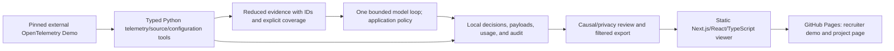

# Recruiter delivery review

**Status: focused recruiter delivery published and verified on October 5, 2026.**
This review covers the developer's clarified goal: one recruiter demo and an
explanatory project/learning page. It supplies the architecture, demo flow,
measurements, deployment, tradeoffs, limitations, resume wording, and interview
questions requested by checkpoint 5. It does not declare all PRD section 52
requirements complete. Checkpoints 1 and 2 are acknowledged; the agent remains
read-only, and AWS resources have not been created.

## Architecture and deployment

Prometheus, OpenSearch, and Jaeger provide real local telemetry. The loop can
also read allowlisted source/current configuration and restricted Kubernetes
state. It receives selected evidence rather than full audit history. Pydantic
validates model decisions, and application code enforces tools and references.
Recommendations have no write executor. The developer-owned fault exercise
injects/resets the lab and captures baseline/recovery outside the agent.

Pages hosts only exported HTML, CSS, JavaScript, and reviewed public data. The
Actions workflow checks Python 3.12/3.14, validates the recording, builds and
browser-tests the site, then deploys main with scoped Pages/OIDC permissions.
There is no public inference endpoint or cloud incident lab. Expected hosting
cost is $0 within GitHub's quotas; browsing uses no model credits. Student Pro
is available while eligible, but this public-repository path also works on Free.
[Pages documentation](https://docs.github.com/en/pages/getting-started-with-github-pages/using-custom-workflows-with-github-pages),
[Actions billing](https://docs.github.com/en/billing/concepts/product-billing/github-actions).

Verified public URLs:

- [Landing](https://alesiobarquin.github.io/sentinel/).
- [Interactive investigation](https://alesiobarquin.github.io/sentinel/demo/).
- [Project and learning explanation](https://alesiobarquin.github.io/sentinel/project/).
- [Original Sentinel source](https://github.com/Alesiobarquin/sentinel).

## Two-minute demo flow

1. Open the landing page, explain the incident and the distinction between the
   external target and original Sentinel code, then enter the investigation.
2. Step from inventory to metrics, logs, and traces. Inspect original tool
   arguments, three raw counter samples, correlation IDs, and omitted spans.
3. Open source/configuration: the matching error branch and enabled 100% flag
   distinguish the intentional fault from the model's credential-error hypothesis.
4. Jump to diagnosis and click a citation to inspect its actual evidence.
   Explain the baseline comparison, confidence limitation, usage, and budgets.
5. Open recovery. The developer helper reset the fault; five recovery reads
   succeeded with zero sampled payment errors. Sentinel did not execute changes.
6. Open the project page: architecture, design choices, failed attempts, lessons,
   validation, limitations, and reproducible commands. Link the source for depth.

Playback is condensed presentation; displayed timestamps and timings are the
original recording. The downloadable public record retains evidence IDs, selected
data, coverage, and source-record hashes. Full private records remain local.

## Measured validation

| Layer | Recorded result | Meaning |
| --- | --- | --- |
| Deterministic Python | 122 passed; eight opt-in live skips; compilation passed | Contracts, reductions, policy, auth/transport, audits, fixtures, publication checks. |
| Frontend | TypeScript and static export passed | The actual repository-path production export builds. |
| Browser | 22 Chromium checks passed locally and on public Pages, desktop and mobile | Navigation, playback, citations, direct routes, downloads, recovery, responsive layout, useful 404, and no external execution requests. |
| Visual review | Six local screenshots plus public landing inspected | Landing, diagnosis, and project on desktop/mobile; actual public rendering. |
| Hosted release | Python 3.12/3.14, web, and Pages jobs passed | Tested source was deployed through the gated workflow. |
| Real telemetry | Six integration checks passed | Actual local metrics/log/trace adapter compatibility. |
| Kubernetes | Two integration checks passed separately | Read-only fixture works; writes, secrets, and other namespaces denied. |
| Deterministic scenarios | Three real faults captured and reset | Payment, EmptyCart, and intermittent ad ground truth and evidence, without AI quality scores. |
| Correct AI case | One causally correct payment diagnosis | Eight model calls/eight reads; 45,171 input + 3,209 output tokens; 120,076.353 ms. |

The correct run is `b4e5c4bc-ad01-4fde-b147-6446762705e2`, using the explicitly
selected `gpt-5.6-luna` account model. Two earlier AI investigations failed and
are preserved. This development sequence is not a controlled accuracy benchmark.
Exact subscription credit/dollar consumption is unavailable; the token total is
reported usage, not a price. See [checkpoint 2](02-first-investigation.md),
[progress](../progress.md), and [real adapter validation](../validation/read-only-agent.md).
The [public site validation record](../validation/recruiter-site.md) links the
successful deployment and records endpoint/browser checks.

## Tradeoffs and limitations

- Deterministic reduction keeps context bounded, but sampling can omit evidence.
  The UI retains raw sample counts, limits, omissions, and snapshot qualifications.
- One explicit native loop keeps policy/audit behavior understandable. Additional
  agents are unjustified without evaluation gains.
- File persistence makes the local pipeline reproducible; it does not provide
  the database-backed, multi-user operator product planned in the guide.
- Static delivery is reliable without the developer's computer or model access.
  Visitors inspect a real recording; they cannot request a new live investigation.
- The exporter has explicit payment-evidence schemas. Privacy review is still
  required for any new record; pattern screening cannot detect every secret.
- The recorded run's OTLP export timed out. Its 25 local self-trace spans remain;
  complete delivery to Jaeger is unverified. Earlier instrumentation checks are
  separate evidence, not a substitute for that failed export.
- Browser validation covers desktop/mobile Chromium, not every browser or a full
  accessibility audit. Mobile overflow was found and fixed; failures were retained.
- Subscription preview prevents an exact server-side credit/output-token cap.
  Local call/time/byte limits and reported-token accounting remain bounded.
- Ten-plus AI-evaluated scenarios, measured general root-cause accuracy,
  GitHub deployment context, incident chat, controlled approval/remediation, MCP,
  and disposable AWS/Terraform deployment remain future PRD work. A separate kind
  reader fixture exists; the application still runs the external target in Compose.

## Defensible resume wording

Choose wording that you can explain and demonstrate yourself:

- Built Sentinel, a read-only AI incident investigator with typed telemetry tools,
  bounded evidence/hypotheses, application-enforced policy, and an auditable model
  loop; diagnosed a real injected payment fault using correlated logs, metrics,
  traces, source, and configuration.
- Implemented and tested Prometheus, OpenSearch, and Jaeger adapters plus
  restricted Kubernetes reads; created reproducible fault/recovery scenarios
  and 122 deterministic checks with separate opt-in live validation.
- Published an interactive Next.js/TypeScript investigation replay and engineering
  case study through gated GitHub Actions/Pages, using reviewed evidence exports
  and 22 desktop/mobile browser checks without inference costs per visit.

Avoid claiming production deployment, an accuracy percentage, calibrated
confidence, autonomous remediation, full AWS infrastructure, or original authorship
of the OpenTelemetry Demo. Do not claim every component was written unaided;
be able to explain the design, tests, failures, and modifications.

## Interview questions and reproduction

1. How does the source branch and flag snapshot distinguish this fault from an
   invalid payment credential? Which conclusions still need qualification?
2. Why can a counter increase be fractional, and why does one raw counter sample
   mean unknown rather than zero? What can bounded traces omit?
3. What policy runs outside prompts? How do tool argument schemas, prior evidence
   references, source allowlists, and Kubernetes RBAC prevent unsafe behavior?
4. How did the real streaming response differ from the fixture assumption? How
   was the failure retained, reproduced offline, and fixed without weakening policy?
5. Which records reach model context, which remain in audit, and which become
   public? What do hash binding and causal/privacy review each contribute?
6. How are calls, tokens, bytes, latency, and unknown costs tracked? What exact
   cap is impossible with the selected subscription preview?
7. Why host a static replay rather than keep 28 lab services running publicly?
   How would requirements for live incidents change the deployment?
8. What would the next reliable AI evaluation measure, and why is one correct
   case insufficient to claim an accuracy rate?

See [site operation](../recruiter-site.md), [site learning](../learning/recruiter-site.md),
[local investigation reproduction](02-first-investigation.md),
and [the manual payment runbook](../runbooks/payment-failure.md).
